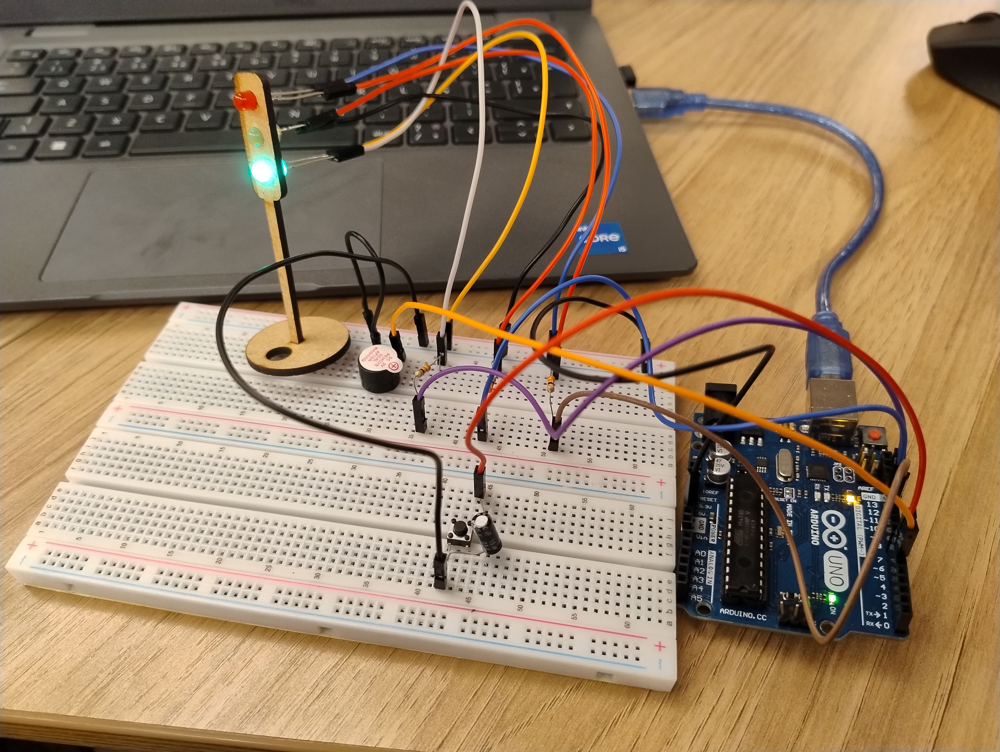

# Projeto Semáforo com Arduino

Este projeto consiste na criação de um semáforo funcional utilizando um **Arduino**. O projeto original exigia apenas um ciclo simples de semáforo, mas foi expandido para incluir um **potenciômetro**, um **botão** e um **buzzer**, adicionando funcionalidades como ajuste dinâmico dos tempos de cada luz do semáforo e interatividade adicional ao circuito.

## Circuito

### Componentes do Circuito

- **LEDs** (Vermelho, Amarelo e Verde): Indicadores do semáforo para os estados de parada, atenção e siga.
- **Arduino**: Microcontrolador que gerencia o ciclo do semáforo e processa as entradas do potenciômetro e do botão.
- **Potenciômetro**: Controla dinamicamente o tempo de cada LED, permitindo ajustes manuais do intervalo de cada luz.
- **Botão**: Permite intervenção manual para ajustar os tempos dos LEDs.
- **Buzzer**: Emite um som a cada mudança de estado, sinalizando a transição de luzes.
- **Capacitor**: Utilizado para o **debounce** do botão, evitando leituras incorretas.
- **Resistores**: Protegem os LEDs de sobrecarga e garantem a segurança do circuito.

### Esquema do Circuito

<div align="center">
    
    
</div>

### Explicação do Circuito

1. **Luzes do Semáforo**: Os LEDs (verde, amarelo e vermelho) representam o funcionamento básico de um semáforo, indicando quando parar, ter atenção e seguir.
2. **Potenciômetro**: Conectado ao Arduino, o potenciômetro ajusta dinamicamente os intervalos de cada luz do semáforo.
3. **Botão**: Permite ajustes nos tempos das luzes durante a execução do ciclo. O debounce foi suavizado com o uso de um capacitor.
4. **Buzzer**: Indica as mudanças de estados com diferentes padrões de som para cada transição.
5. **Resistores**: Garantem a proteção dos LEDs contra picos de corrente.

## Código

O código foi desenvolvido em **C++**, com uso de **Programação Orientada a Objetos (POO)**. A classe `TrafficLight` encapsula as operações e estados do semáforo, incluindo o controle dos LEDs, buzzer e a leitura do potenciômetro e do botão. **Ponteiros** foram utilizados para facilitar o controle dos pinos de cada componente, tornando o código modular e flexível.

```cpp
// Definições de pinos e bibliotecas
const int potentiometer = A0;

class TrafficLight {
  private:
    // Atributos do semáforo
    int *greenPin, *yellowPin, *redPin, *buttonPin, *buzzerPin;
    int redInterval, yellowInterval, greenInterval;
    int adjustedRedTime, adjustedYellowTime, adjustedGreenTime;
    int trafficLightState;
    unsigned long previousTime;
    unsigned long lastButtonTime;
    const unsigned long debounceDelay = 50;
    bool buttonPressed;

  public:
    // Construtor para inicializar os atributos
    TrafficLight(int *green, int *yellow, int *red, int *button, int *buzzer)
      : greenPin(green), yellowPin(yellow), redPin(red), 
        buttonPin(button), buzzerPin(buzzer), previousTime(0), 
        lastButtonTime(0), buttonPressed(false) {
        
      trafficLightState = 0; 
      redInterval = 5000;
      yellowInterval = 2000;
      greenInterval = 5000;

      // Definir os pinos como saídas ou entrada
      pinMode(*greenPin, OUTPUT);
      pinMode(*yellowPin, OUTPUT);
      pinMode(*redPin, OUTPUT);
      pinMode(*buttonPin, INPUT_PULLUP);
      pinMode(*buzzerPin, OUTPUT);
    }

    // Método para atualizar o semáforo
    void update() {
      adjustIntervals();
      manageButton();
      unsigned long currentTime = millis();

      switch (trafficLightState) {
        case 0: // Estado do LED Vermelho
          digitalWrite(*redPin, HIGH);
          digitalWrite(*yellowPin, LOW);
          digitalWrite(*greenPin, LOW);

          if (currentTime - previousTime >= adjustedRedTime) {
            changeToYellow();
          }
          break;

        case 1: // Estado do LED Amarelo (pós-vermelho)
          digitalWrite(*redPin, LOW);
          digitalWrite(*yellowPin, HIGH);
          digitalWrite(*greenPin, LOW);

          if (currentTime - previousTime >= adjustedYellowTime) {
            changeToGreen();
          }
          break;

        case 2: // Estado do LED Verde
          digitalWrite(*greenPin, HIGH);
          digitalWrite(*yellowPin, LOW);
          digitalWrite(*redPin, LOW);

          if (currentTime - previousTime >= adjustedGreenTime) {
            changeToYellowBeforeRed();
          }
          break;

        case 3: // Estado do LED Amarelo (pré-vermelho)
          digitalWrite(*redPin, LOW);
          digitalWrite(*yellowPin, HIGH);
          digitalWrite(*greenPin, LOW);

          if (currentTime - previousTime >= adjustedYellowTime) {
            changeToRed();
          }
          break;
      }
    }

    // Ajustar os intervalos com base no potenciômetro
    void adjustIntervals() {
      int potentiometerReading = analogRead(potentiometer);
      adjustedRedTime = map(potentiometerReading, 0, 1000, 5000, 60000);
      adjustedYellowTime = map(potentiometerReading, 0, 1000, 2000, 10000);
      adjustedGreenTime = map(potentiometerReading, 0, 1000, 5000, 60000);

      // Exibir os intervalos no Serial Monitor
      Serial.print("Potenciometro: ");
      Serial.println(potentiometerReading);
      Serial.print("Intervalo Vermelho: ");
      Serial.println(adjustedRedTime);
      Serial.print("Intervalo Amarelo: ");
      Serial.println(adjustedYellowTime);
      Serial.print("Intervalo Verde: ");
      Serial.println(adjustedGreenTime);
    }

    // Método para gerenciar o botão
    void manageButton() {
      int buttonReading = digitalRead(*buttonPin);
      if (buttonReading == LOW && (millis() - lastButtonTime > debounceDelay)) {
        buttonPressed = true;
        lastButtonTime = millis();
        Serial.println("Botao pressionado");
        
        // Ajustar o intervalo conforme o estado do semáforo
        if (trafficLightState == 0) {
          adjustedRedTime = max(2000, adjustedRedTime - 2000);
          Serial.println("Tempo do LED Vermelho reduzido por botao");
        } else if (trafficLightState == 2) {
          adjustedGreenTime += 2000;
          Serial.println("Tempo do LED Verde aumentado por botao");
        }
      } else {
        buttonPressed = false;
      }
    }

    // Métodos para transições de estado
    void changeToYellow() {
      trafficLightState = 1;
      previousTime = millis();
      Serial.println("Mudou para o LED Amarelo (pós-vermelho)");
    }

    void changeToGreen() {
      trafficLightState = 2;
      previousTime = millis();
      buzz(1);
      Serial.println("Mudou para o LED Verde");
    }

    void changeToYellowBeforeRed() {
      trafficLightState = 3;
      previousTime = millis();
      Serial.println("Mudou para o LED Amarelo (pré-vermelho)");
    }

    void changeToRed() {
      trafficLightState = 0;
      previousTime = millis();
      buzz(3);
      Serial.println("Mudou para o LED Vermelho");
    }

    // Método para o buzzer
    void buzz(int times) {
      for (int i = 0; i < times; i++) {
        tone(*buzzerPin, 1000, 100);
        delay(200); // Pausa entre os apitos
      }
      noTone(*buzzerPin);
      Serial.print("Buzzer tocou ");
      Serial.print(times);
      Serial.println(" vez(es)");
    }
};

// Instância da classe TrafficLight
int greenPin = 13, yellowPin = 12, redPin = 11, buttonPin = 7, buzzerPin = 6;
TrafficLight trafficLight(&greenPin, &yellowPin, &redPin, &buttonPin, &buzzerPin);

void setup() {
  Serial.begin(9600);
}

void loop() {
  // Atualiza o estado do semáforo
  trafficLight.update();
}
```

## Funcionamento do Projeto

1. O **Arduino** lê o valor do **potenciômetro** e ajusta os intervalos de tempo de cada LED de acordo com a leitura.
2. O **botão** permite ajustar os tempos de uma determinada luz dependendo do estado atual do semáforo, e o debounce é suavizado pelo capacitor.
3. O **buzzer** emite sons em cada transição de estado para indicar as mudanças de luz (verde, amarelo e vermelho), com diferentes padrões para cada estado.
4. **Resistores** protegem os LEDs, permitindo que o circuito opere de forma segura.

## Saída de Exemplo

```
Potenciometro: 512
Intervalo Vermelho: 15000 ms
Intervalo Amarelo: 5000 ms
Intervalo Verde: 10000 ms
Botao pressionado
Tempo do LED Verde aumentado por botao
Mudou para o LED Amarelo (pós-vermelho)
Buzzer tocou 1 vez
```

## Demonstração do Circuito

<div align="center">
    
    <video src="assets/demo.mp4" controls></video>
</div>

## Ferramentas e Montagem

O projeto foi montado fisicamente, sem uso de simuladores. Todos os componentes foram conectados diretamente ao Arduino e ajustados manualmente para garantir o correto funcionamento e a segurança do sistema.

### Observações

- Foram utilizados resistores para evitar danos aos LEDs.
- Um capacitor foi empregado para filtrar o debounce do botão.

## Avaliação

### Avaliador: Cibele Leal
<div align="center">

| Critério                                                                                                            | Contempla (Pontos) | Contempla Parcialmente (Pontos) | Não Contempla (Pontos) | Observações do Avaliador |
| ------------------------------------------------------------------------------------------------------------------- | ------------------ | ------------------------------- | ---------------------- | ------------------------ |
| Montagem física com cores corretas, boa disposição dos fios e uso adequado de resistores                            | Até 3              | Até 1,5                         | 0                      |                          |
| Temporização adequada conforme tempos medidos com auxílio de algum instrumento externo                              | Até 3              | Até 1,5                         | 0                      |                          |
| Código implementa corretamente as fases do semáforo e estrutura do código (variáveis representativas e comentários) | Até 3              | Até 1,5                         | 0                      |                          |
| Extra: Implmeentou um componente de liga/desliga no semáforo e/ou usou ponteiros no código                          | Até 1              | Até 0,5                         | 0                      |                          |
|                                                                                                                     |                    |                                 |                        | **Pontuação Total**      |

</div>